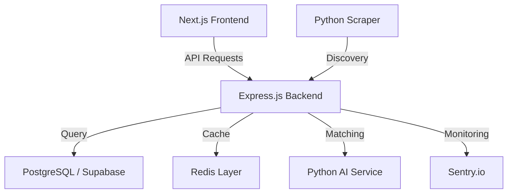

# ScholarHub — Professional Scholarship Marketplace

ScholarHub is a production-grade, AI-powered scholarship platform designed to connect students with life-changing opportunities through semantic matching and secure, automated tracking.

## 🌟 Key Features
- **Smart AI Matching**: Vector-based semantic engine for high-precision scholarship discovery.
- **Design Engineer UI**: Industrial, zero-radius aesthetic with premium micro-interactions.
- **Enterprise Security**: JWT authentication, Sentry error monitoring, and Rate-limiting protection.
- **Scalable Architecture**: Dockerized multi-service ecosystem (Next.js, Express, FastAPI).
- **Advanced Performance**: Redis-backed caching and Gzip compression.

## 🏗️ Technical Architecture


## 📚 Subject Documentation
- [Frontend Guide (INT219)](docs/FRONTEND.md)
- [Backend Guide (INT222)](docs/BACKEND.md)
- [API Reference](docs/API.md)
- [Database (ER Diagram)](docs/ER_DIAGRAM.md)
- [Project Statistics](docs/STATS.md)
- [Deployment Guide (GCP)](docs/GCP_DEPLOY_GUIDE.md)

## 🛠️ Getting Started
1. **Prerequisites**: Node.js v20+, Python 3.11+, Docker.
2. **Installation**:
   ```bash
   # Run the entire ecosystem
   docker-compose up --build
   ```
3. **Environment**: Copy `.env.example` to `.env` in `backend`, `frontend`, and `ai_service`.

## 📜 License
Developed for Academic Excellence (INT219/INT222).
