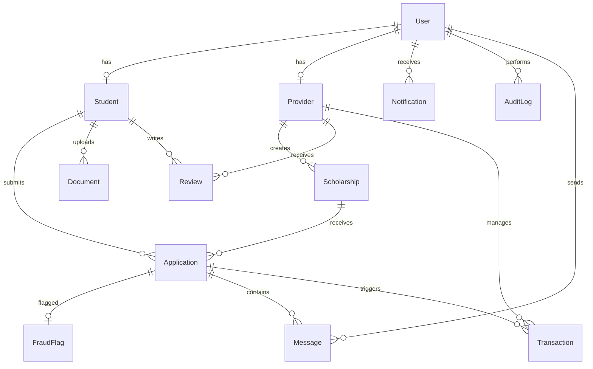

# ⚙️ Backend Architecture — ScholarHub

> **Framework**: Express.js 5 · **ORM**: Prisma 7 · **Database**: PostgreSQL (Supabase)

---

## Overview

RESTful API serving as the central orchestration layer. Features JWT auth with 2FA, role-based access control, AI-powered matching with Redis caching, fraud detection, Cloudinary document vault, PostgreSQL Full-Text Search, and comprehensive audit logging.

---

## Architecture

```
backend/src/
├── index.js              # Entry: middleware, routes, cron, error handler
├── controllers/          # 13 route handlers
├── routes/               # 13 Express Router modules
├── middleware/            # Auth, upload, validation
├── services/             # AI proxy, notification engine
├── schemas/              # Zod validation
├── utils/                # Cache, matching algorithm
├── lib/                  # Prisma client, Cloudinary config
└── __tests__/            # Jest smoke tests
```

---

## Database Schema (14 Models, 6 Enums)



### Models

| Model | Key Fields | Description |
|-------|------------|-------------|
| **User** | email, password, role, is2FAEnabled | Core identity |
| **Student** | name, cgpa, incomeLevel, fieldOfStudy, location | Academic profile |
| **Provider** | orgName, trustScore, verificationStatus | Organization profile |
| **Scholarship** | title, amount, deadline, criteriaJson, status | Listings with FTS |
| **Application** | studentId+scholarshipId (unique), status, formData | Submissions |
| **Document** | fileUrl, publicId, fileHash, docType | Cloud-stored files |
| **FraudFlag** | fraudScore, featuresJson | AI fraud results |
| **AuditLog** | entityType, entityId, action, actorId | Compliance trail |
| **Message** | content, isRead | In-app messaging |
| **Transaction** | amount, type (DEPOSIT/DISBURSEMENT), status | Financial tracking |
| **Notification** | type, title, message, isRead | In-app alerts |
| **Review** | rating, comment, isModerated | Provider reviews |
| **NewsletterSubscriber** | email, isActive | Subscriptions |

### Enums

| Enum | Values |
|------|--------|
| `Role` | STUDENT, PROVIDER, ADMIN |
| `ScholarshipStatus` | DRAFT, PENDING_REVIEW, ACTIVE, CLOSED |
| `ApplicationStatus` | PENDING, UNDER_REVIEW, SHORTLISTED, INTERVIEWING, APPROVED, REJECTED |
| `VerificationStatus` | PENDING, APPROVED, REJECTED |
| `TransactionType` | DEPOSIT, DISBURSEMENT |
| `TransactionStatus` | PENDING, COMPLETED, FAILED |

---

## Authentication & Security

### JWT Token Strategy

| Token | Expiry | Purpose |
|-------|--------|---------|
| Access Token | 15 min | API authorization |
| Refresh Token | 7 days | Silent renewal |
| 2FA Temp Token | 15 min | Pre-OTP verification |

### Security Stack

- **bcrypt** (12 rounds) for password hashing
- **Email-based 2FA** with OTP (10-min expiry, bcrypt-hashed)
- **Google OAuth** via NextAuth.js with auto-registration
- **Password Reset** with SHA-256 hashed tokens (1-hour expiry)
- **Helmet** for security headers
- **Rate Limiting** (3 tiers — see below)
- **Zod** input validation
- **Anti-enumeration** responses on forgot-password

### Auth Middleware

```javascript
authenticate(req, res, next)   // JWT verify + scraper key bypass
authorize(...roles)             // Role-based access control
optionalAuth(req, res, next)   // Non-failing auth for public routes
```

---

## API Routes (13 Modules)

| Module | Path | Auth | Endpoints |
|--------|------|------|-----------|
| **Auth** | `/api/auth` | Mixed | register, login, google, 2fa, refresh, me, profile, password |
| **Scholarships** | `/api/scholarships` | Optional/Provider | CRUD, search (FTS), AI matching, bulk upsert |
| **Applications** | `/api/applications` | Student/Provider | submit (+ fraud check), track, review, approve/reject |
| **Admin** | `/api/admin` | Admin | stats, users, providers, scholarships, fraud, audit, scraper |
| **Providers** | `/api/providers` | Yes | profile, verification |
| **Documents** | `/api/documents` | Yes | Cloudinary upload/delete |
| **Messages** | `/api/messages` | Yes | per-application messaging |
| **Notifications** | `/api/notifications` | Yes | feed, mark read |
| **Reviews** | `/api/reviews` | Yes | create, moderate |
| **Stats** | `/api/stats` | Yes | analytics |
| **Newsletter** | `/api/newsletter` | No | subscribe/unsubscribe |
| **Billing** | `/api/billing` | Provider | transactions |
| **Scraper** | `/api/scraper` | System | bulk data ingestion |

---

## Rate Limiting

| Tier | Window | Max Requests | Routes |
|------|--------|--------------|--------|
| Global | 15 min | 300 | All `/api/*` |
| Auth | 1 hour | 10 | `/api/auth/*` |
| Task | 1 hour | 20 | `/api/scraper/*` |

---

## Caching (Redis + In-Memory Fallback)

Dual-layer cache: Redis for distributed environments, in-memory `Map` fallback for local dev.

| Data | TTL | Description |
|------|-----|-------------|
| AI Match Scores | 30 min | Prevents repeated AI service calls |

Redis errors are logged but never crash the server.

---

## Notification Engine (Dual-Channel)

| Event | In-App | Email |
|-------|--------|-------|
| Application Submitted | ✅ | ✅ |
| Status Change (approved/rejected/review) | ✅ | ✅ |
| Provider Verified | ✅ | ✅ |
| Deadline Reminder (3 days) | ✅ | ✅ |
| New External Scholarships | — | ✅ |

All emails use premium responsive HTML templates with brand colors, CTAs, and personalized content.

---

## Scheduled Tasks (node-cron)

| Task | Schedule | Description |
|------|----------|-------------|
| Deadline Reminders | 9 AM daily | Alerts for scholarships expiring in ≤3 days |
| Scholarship Scraper | 6 AM daily | Python scraper execution with `--live` |

---

## AI Service Integration

```javascript
getMatchScores(student, scholarships)  // → FastAPI /api/matching
checkFraud(applicationData)            // → FastAPI /api/fraud/check
```

**Resilience**: AI failures fall back to local matching algorithm. Results are cached for 30 minutes.

---

## Error Handling

- **Sentry** integration for production monitoring (when `SENTRY_DSN` is set)
- **Global catch-all** handler with environment-aware error messages
- Stack traces only exposed in development
