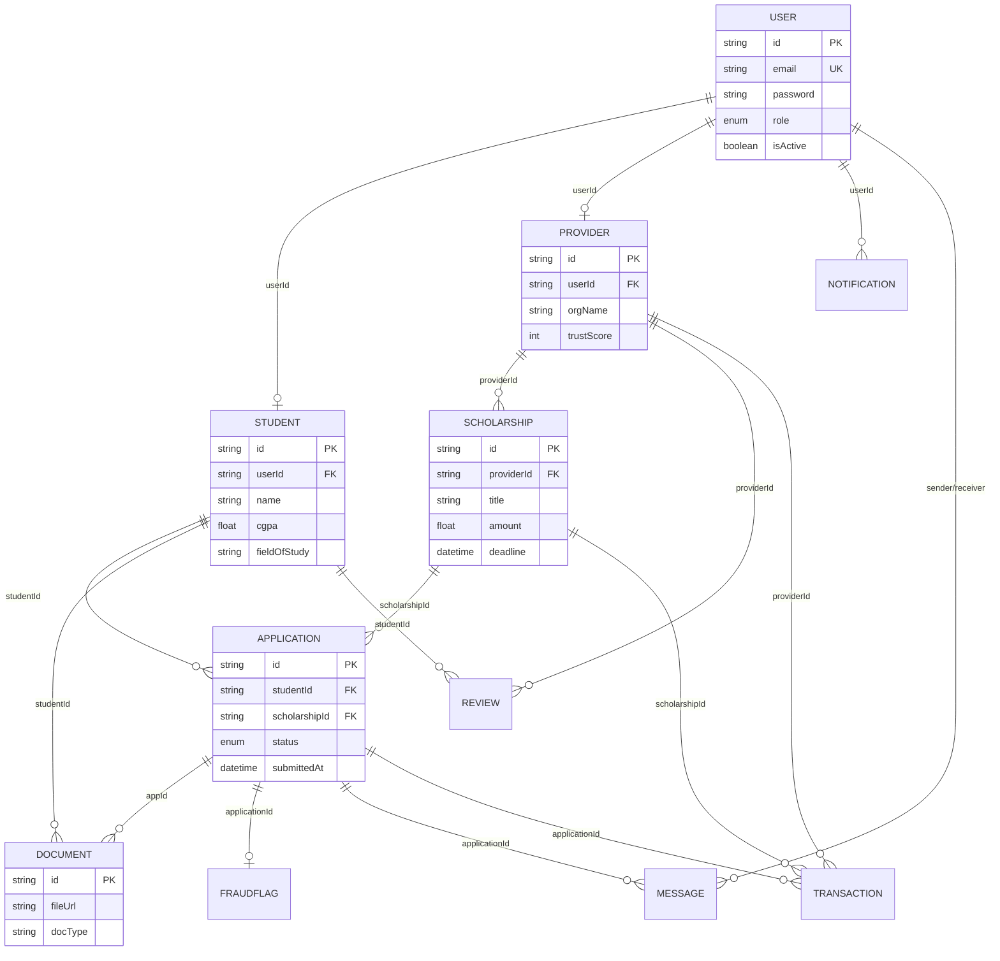

# ScholarHub — Entity Relationship (ER) Diagram

This diagram illustrates the database architecture of the ScholarHub platform, built with PostgreSQL and Prisma.

## Core Relationships
1. **User - Roles**: A 1-to-1 relationship between `User` and `Student` or `Provider`.
2. **Scholarship - Applications**: A 1-to-many relationship where a single scholarship can have multiple student applications.
3. **Application - Integrity**: Linked to `Document` for verification and `FraudFlag` for AI-based security scoring.
4. **Communication**: `Messages` are tied to specific `Applications` to ensure context-aware chat between students and providers.
