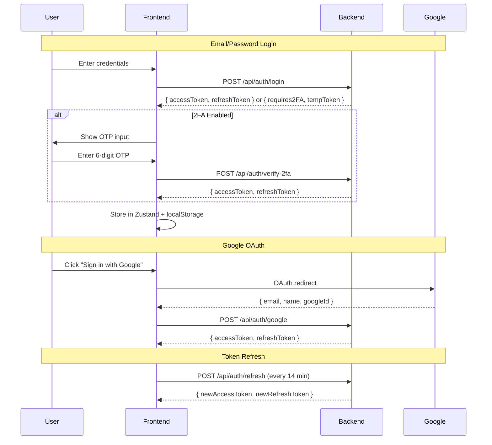

# 🎨 Frontend Architecture — ScholarHub

> **Framework**: Next.js 16 (App Router) · **Language**: TypeScript · **Styling**: Tailwind CSS 4 + Shadcn/UI

---

## Table of Contents

- [Overview](#overview)
- [Design System](#design-system)
- [Page Architecture](#page-architecture)
- [Component Library](#component-library)
- [State Management](#state-management)
- [Authentication Flow](#authentication-flow)
- [Key Libraries](#key-libraries)

---

## Overview

The frontend is a **Next.js 16 App Router** application built with **React 19** and **TypeScript**. It features server-side rendering, file-based routing, and a premium dark-mode-first design system with amber accents, grid-line backgrounds, and glassmorphism effects.

### Design Philosophy

- **Dark-mode first**: Pure black (`#000000`) background with amber (`#fbbf24`) accent system
- **Sharp edges**: `border-radius: 0px` everywhere for a brutalist, design-engineer aesthetic
- **Grid-line background**: Subtle 50px CSS grid pattern for visual texture
- **Premium typography**: Inter (body) + Plus Jakarta Sans (headings) from Google Fonts
- **Micro-animations**: Framer Motion and GSAP for scroll-triggered animations, hover effects, and page transitions

---

## Design System

### Color Tokens

| Token | Light | Dark | Purpose |
|-------|-------|------|---------|
| `--background` | `#ffffff` | `#000000` | Page background |
| `--foreground` | `#000000` | `#ffffff` | Primary text |
| `--primary` | `#fbbf24` | `#fbbf24` | Amber accent (CTA, links, scrollbar) |
| `--card` | `#ffffff` | `#0a0a0a` | Card surfaces |
| `--muted-foreground` | `#666666` | `#888888` | Secondary text |
| `--destructive` | `#eb5757` | `#ff4d4d` | Error states |
| `--border` | `#eaeaea` | `#1a1a1a` | Dividers and grid lines |

### Typography Scale

| Class | Font | Weight | Tracking | Use Case |
|-------|------|--------|----------|----------|
| `display-massive` | Plus Jakarta Sans | 900 | Tighter | Hero headlines |
| `h1, h2, h3` | Plus Jakarta Sans | 800 | Tight | Section headings |
| `h4, h5, h6` | Plus Jakarta Sans | 700 | Tight | Subheadings |
| `body (p)` | Inter | 400 | Normal | Body text |
| `label-technical` | Inter | 700 | 0.2em | Uppercase micro-labels |

### Utility Classes

| Class | Description |
|-------|-------------|
| `.glass` | Glassmorphism: `bg-background/40 backdrop-blur-xl border border-border` |
| `.label-technical` | Uppercase, italic, amber, 10px tracking label |
| `.display-massive` | Line-height: 0.9, extra-bold serif heading |

---

## Page Architecture

```
app/
├── page.tsx                    # Landing page (13 sections)
├── layout.tsx                  # Root: fonts, ThemeProvider, AuthProvider, Lenis, Toaster
├── globals.css                 # Design system tokens + Tailwind config
├── sitemap.ts                  # Dynamic SEO sitemap generator
├── robots.ts                   # SEO robots.txt configuration
├── not-found.tsx               # Custom 404 page
│
├── (auth)/                     # Authentication group
│   ├── layout.tsx              # Minimal auth layout
│   ├── login/page.tsx          # Login with email/password + Google OAuth
│   ├── register/page.tsx       # Registration (Student or Provider)
│   ├── forgot-password/page.tsx # Password reset request
│   └── reset-password/page.tsx # Password reset form
│
├── dashboard/                  # Protected dashboards
│   ├── student/                # Student dashboard
│   ├── provider/               # Provider dashboard
│   └── admin/                  # Admin dashboard
│
├── scholarships/               # Public scholarship browsing
│   └── page.tsx                # Search, filter, and browse scholarships
│
├── about/                      # About page
├── contact/                    # Contact page
├── community/                  # Community page
├── guides/                     # User guides
├── privacy/                    # Privacy policy
└── terms/                      # Terms of service
```

### Provider Stack (Root Layout)

The root layout wraps the application in the following provider hierarchy:

```
<html>
  <ThemeProvider>          → Dark/light mode (next-themes)
    <Toaster>              → Toast notifications (sonner)
    <AuthProvider>         → Authentication context (NextAuth.js)
      <Suspense>           → React suspense boundary
        <GlobalLoaderProvider>  → Page transition loading states
          <LenisProvider>       → Smooth scrolling (lenis)
            {children}
          </LenisProvider>
        </GlobalLoaderProvider>
      </Suspense>
    </AuthProvider>
  </ThemeProvider>
</html>
```

---

## Component Library

### Landing Page Components (`components/landing/`)

| Component | Description | Size |
|-----------|-------------|------|
| `Navbar.tsx` | Responsive nav with auth-aware menu | 7.0 KB |
| `Hero.tsx` | Animated hero with 3D text effects | 12.2 KB |
| `HowItWorks.tsx` | 3-step process visualization | 8.0 KB |
| `TargetAudience.tsx` | User persona cards | 4.2 KB |
| `Features.tsx` | Feature grid with icons | 5.9 KB |
| `SecurityPromise.tsx` | Trust and security showcase | 4.6 KB |
| `Stats.tsx` | Animated counter statistics | 5.4 KB |
| `FeaturedScholarships.tsx` | Top scholarship cards | 6.1 KB |
| `FAQ.tsx` | Accordion FAQ section | 5.9 KB |
| `FinalCTA.tsx` | Call-to-action banner | 3.0 KB |
| `NewsletterAlerts.tsx` | Email subscription form | 5.6 KB |
| `Footer.tsx` | Multi-column footer with links | 7.7 KB |
| `TrustedPartners.tsx` | Partner logo carousel | 2.0 KB |

### Student Dashboard Components (`components/dashboard/`)

| Component | Description | Size |
|-----------|-------------|------|
| `DashboardLayout.tsx` | Layout wrapper with sidebar | 7.2 KB |
| `DashboardSidebar.tsx` | Navigation sidebar with role detection | 15.1 KB |
| `ScholarshipList.tsx` | AI-matched scholarship cards with search/filter | 33.9 KB |
| `Profile.tsx` | Editable profile with strength meter + AI suggestions | 24.6 KB |
| `ApplicationTracker.tsx` | Application status timeline | 13.8 KB |
| `DocumentVault.tsx` | Cloudinary-backed document manager | 9.4 KB |
| `DocumentViewer.tsx` | File preview modal | 6.6 KB |
| `Notifications.tsx` | Notification feed | 9.0 KB |
| `NotificationsDropdown.tsx` | Navbar notification bell dropdown | 6.3 KB |
| `Settings.tsx` | Account settings (password, 2FA, preferences) | 13.5 KB |
| `ProfileDropdown.tsx` | Avatar menu with logout | 4.9 KB |

### Application Form Components (`components/application/`)

| Component | Description | Size |
|-----------|-------------|------|
| `ApplicationForm.tsx` | Multi-step form orchestrator | 6.0 KB |
| `StepPersonal.tsx` | Step 1: Personal information | 6.6 KB |
| `StepAcademic.tsx` | Step 2: Academic details | 5.8 KB |
| `StepFinancial.tsx` | Step 3: Financial information | 6.2 KB |
| `StepDocuments.tsx` | Step 4: Document uploads | 9.2 KB |
| `StepReview.tsx` | Step 5: Review and submit | 11.0 KB |
| `ReviewModal.tsx` | Provider-side application review dialog | 8.1 KB |
| `MessageHistory.tsx` | In-app chat per application | 5.9 KB |

### Provider Dashboard Components (`components/provider/`)

| Component | Description | Size |
|-----------|-------------|------|
| `ProviderLayout.tsx` | Provider dashboard layout | 9.2 KB |
| `ProviderSidebar.tsx` | Provider navigation sidebar | 11.8 KB |
| `ScholarshipForm.tsx` | Create/edit scholarship with AI description generation | 25.2 KB |
| `KanbanBoard.tsx` | Drag-and-drop application pipeline | 9.0 KB |
| `GlobalSearch.tsx` | Full-text search across scholarships and applications | 11.4 KB |
| `FormBuilder.tsx` | Dynamic form field builder | 6.6 KB |
| `TrustScoreBreakdown.tsx` | Provider trust score visualization | 5.6 KB |
| `SettingCard.tsx` | Provider settings card | 3.4 KB |

### Animation Components

| Component | Description |
|-----------|-------------|
| `SpotlightCard.tsx` | Mouse-tracking spotlight hover effect |
| `TextType.tsx` | Typewriter text animation |
| `VariableProximity.tsx` | Proximity-based variable font weight |

---

## State Management

### Auth Store (Zustand)

```typescript
// app/store/auth.store.ts
interface AuthState {
  user: User | null;
  accessToken: string | null;
  refreshToken: string | null;
  setAuth: (user, accessToken, refreshToken) => void;
  logout: () => void;
}
```

### Server State (TanStack React Query)

Used for all API data fetching with:
- Automatic background refetching
- Stale-while-revalidate caching
- Optimistic updates for mutations

---

## Authentication Flow



---

## Key Libraries

| Library | Version | Usage |
|---------|---------|-------|
| `next` | 16.1.6 | App framework |
| `react` | 19.2.3 | UI library |
| `next-auth` | 4.24.13 | Auth (Google OAuth + credentials) |
| `zustand` | 5.0.11 | Client state management |
| `@tanstack/react-query` | 5.90.21 | Server state management |
| `framer-motion` | 12.38.0 | Animations |
| `gsap` | 3.15.0 | Advanced animations |
| `react-hook-form` | 7.71.2 | Form management |
| `zod` | 4.3.6 | Schema validation |
| `recharts` | 3.8.0 | Dashboard charts |
| `driver.js` | 1.4.0 | Product tours |
| `sonner` | 2.0.7 | Toast notifications |
| `lenis` | 1.3.18 | Smooth scrolling |
| `@hello-pangea/dnd` | 18.0.1 | Drag-and-drop (Kanban) |
| `lucide-react` | 0.577.0 | Icons |
| `@tabler/icons-react` | 3.40.0 | Additional icons |
| `three` | 0.183.2 | 3D graphics |
