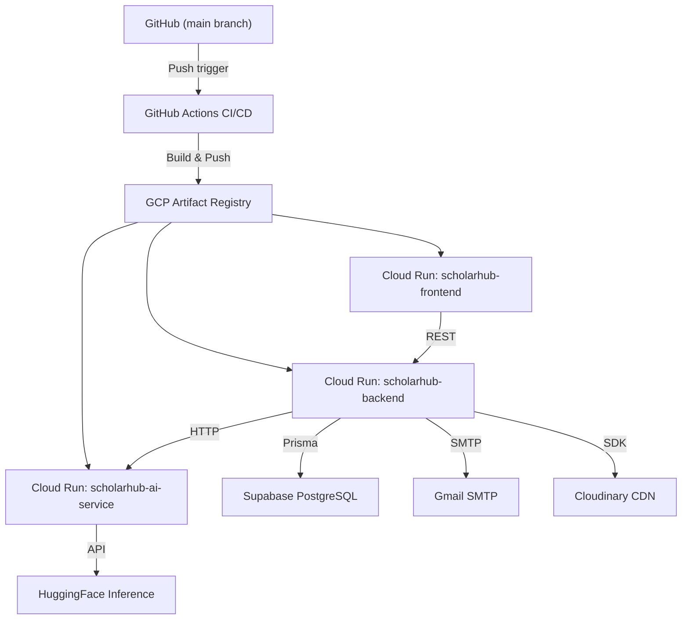

# ☁️ GCP Deployment Guide — ScholarHub

> **Platform**: Google Cloud Run · **CI/CD**: GitHub Actions · **Registry**: GCP Artifact Registry

---

## Overview

ScholarHub deploys automatically to **Google Cloud Run** on every push to the `main` branch. The CI/CD pipeline builds Docker images for all three services, pushes them to GCP Artifact Registry, and deploys them as serverless containers.

---

## Architecture on GCP



---

## Prerequisites

1. **Google Cloud Project** with billing enabled
2. **gcloud CLI** installed and authenticated
3. **Artifact Registry** repository created:
   ```bash
   gcloud artifacts repositories create scholarhub \
     --repository-format=docker \
     --location=us-central1
   ```
4. **Service Account** with the following roles:
   - `Cloud Run Admin`
   - `Artifact Registry Writer`
   - `Service Account User`
5. **GitHub Secrets** configured (see below)

---

## Service Configuration

| Service | Image | Memory | CPU | Timeout | Port |
|---------|-------|--------|-----|---------|------|
| `scholarhub-frontend` | `frontend:$SHA` | 1 GB | Default | Default | 3000 |
| `scholarhub-backend` | `backend:$SHA` | Default | Default | Default | 5000 |
| `scholarhub-ai-service` | `ai-service:$SHA` | 2 GB | 1 vCPU | 300s | 8000 |

> All services run with `--allow-unauthenticated` for public access.

---

## Required GitHub Secrets

| Secret | Description |
|--------|-------------|
| `GCP_PROJECT_ID` | Google Cloud project ID |
| `GCP_SA_KEY` | Service account key JSON (base64 or raw) |
| `DATABASE_URL` | PostgreSQL connection string |
| `JWT_SECRET` | JWT signing key |
| `JWT_REFRESH_SECRET` | Refresh token signing key |
| `HF_API_TOKEN` | HuggingFace API token |
| `EMAIL_USER` | Gmail address for SMTP |
| `EMAIL_PASS` | Gmail app password |
| `EMAIL_FROM` | Sender display name |
| `CLOUDINARY_CLOUD_NAME` | Cloudinary cloud name |
| `CLOUDINARY_API_KEY` | Cloudinary API key |
| `CLOUDINARY_API_SECRET` | Cloudinary API secret |
| `SCRAPER_KEY` | Internal scraper authentication key |
| `GOOGLE_CLIENT_ID` | Google OAuth client ID |
| `GOOGLE_CLIENT_SECRET` | Google OAuth client secret |
| `NEXTAUTH_URL` | Frontend URL (auto-wired after deploy) |
| `NEXTAUTH_SECRET` | NextAuth session secret |
| `FRONTEND_URL` | Frontend URL for CORS/emails |

---

## CI/CD Pipeline Steps

The deployment workflow (`.github/workflows/deploy.yml`) executes these steps:

### 1. Build & Deploy Backend

```yaml
# Copies scraper_service into backend context for bundled deployment
cp -r scraper_service backend/scraper_service
docker build -t .../backend:$SHA ./backend
docker push .../backend:$SHA
# Deploy to Cloud Run with all env vars
```

The backend Dockerfile is a multi-stage build that:
- Installs Node.js dependencies
- Generates Prisma client
- Installs Python + scraper dependencies
- Bundles the scraper service for cron execution

### 2. Build & Deploy AI Service

```yaml
docker build -t .../ai-service:$SHA ./ai_service
docker push .../ai-service:$SHA
# Deploy with 2GB RAM, 1 CPU, 300s timeout
# Inject BACKEND_URL from Step 1 output
```

### 3. Build & Deploy Frontend

```yaml
docker build \
  --build-arg NEXT_PUBLIC_API_URL=$BACKEND_URL/api \
  --build-arg NEXT_PUBLIC_AI_URL=$AI_URL \
  -t .../frontend:$SHA ./frontend
# Deploy with 1GB RAM
# Inject NextAuth and OAuth secrets
```

### 4. Service Wiring

After all three services are deployed, the pipeline wires them together:

```bash
# Fix NextAuth redirect URLs
gcloud run services update scholarhub-frontend \
  --update-env-vars NEXTAUTH_URL=$FRONTEND_URL

# Fix Backend CORS and AI connection
gcloud run services update scholarhub-backend \
  --update-env-vars FRONTEND_URL=$FRONTEND_URL,AI_SERVICE_URL=$AI_URL

# Fix AI Service CORS
gcloud run services update scholarhub-ai-service \
  --update-env-vars FRONTEND_URL=$FRONTEND_URL
```

---

## Manual Deployment

If you need to deploy manually:

```bash
# Authenticate
gcloud auth login
gcloud config set project YOUR_PROJECT_ID

# Build and push
docker build -t us-central1-docker.pkg.dev/PROJECT_ID/scholarhub/backend:latest ./backend
docker push us-central1-docker.pkg.dev/PROJECT_ID/scholarhub/backend:latest

# Deploy
gcloud run deploy scholarhub-backend \
  --image us-central1-docker.pkg.dev/PROJECT_ID/scholarhub/backend:latest \
  --region us-central1 \
  --allow-unauthenticated \
  --set-env-vars DATABASE_URL=...,JWT_SECRET=...
```

---

## Database Migrations

Run Prisma migrations against the production database:

```bash
DATABASE_URL="your-production-url" npx prisma migrate deploy
```

---

## Monitoring

- **Sentry**: Error tracking and performance monitoring (configured via `SENTRY_DSN`)
- **Cloud Run Logs**: `gcloud run services logs read scholarhub-backend --region us-central1`
- **Health Checks**: `GET /` on backend and `GET /health` on AI service

---

## Troubleshooting

| Issue | Solution |
|-------|----------|
| CORS errors | Verify `FRONTEND_URL` is set on backend and AI service |
| NextAuth redirect loops | Ensure `NEXTAUTH_URL` matches the deployed frontend URL |
| AI service timeouts | AI service needs 2GB RAM and 300s timeout for model loading |
| Prisma connection errors | Verify `DATABASE_URL` includes `?sslmode=require` for Supabase |
| Scraper not running | Check Python is installed in the backend container |
